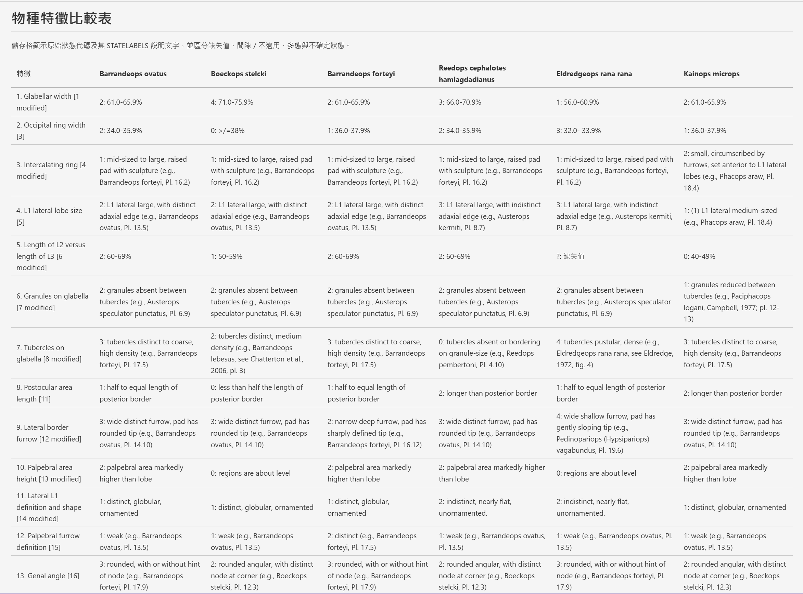

# nex2desc

以 Python 讀取 [PAUP*](https://paup.phylosolutions.com/) / [NEXUS](https://en.wikipedia.org/wiki/Nexus_file) .nex 形態特徵資料，選擇一個或多個物種，輸出 Markdown 比較表。只使用標準函式庫，不需要安裝第三方套件。

## 環境

Python 3.10 或更新版本。

## 使用方式

在專案目錄開啟終端機：

~~~powershell
# 互動模式：先列出 TAXLABELS，再輸入編號，例如 1,3,5-7 或 all
python .\nex2desc.py .\2009-early-and-middle-devonian-phacopidae-of-south-moroccan.nex

# 依物種名稱選取，包含空白的名稱需加引號
python .\nex2desc.py .\2009-early-and-middle-devonian-phacopidae-of-south-moroccan.nex --taxa "Calyptaulax glabella" "Acernaspis orestes" -o .\generated\comparison.md

# 也可指定編號、範圍，或全部物種
python .\nex2desc.py .\2009-early-and-middle-devonian-phacopidae-of-south-moroccan.nex --taxa 1 3-5
python .\nex2desc.py .\2009-early-and-middle-devonian-phacopidae-of-south-moroccan.nex --taxa all

# 只列出物種，不產生檔案
python .\nex2desc.py .\2009-early-and-middle-devonian-phacopidae-of-south-moroccan.nex --list-taxa
~~~

- 預設輸出至 generated 目錄，檔名為輸入檔案的名稱（不含副檔名）加上 .md，也可使用 -o 指定。
- 輸出目錄會自動建立；既有檔案不會被覆寫，除非指定 --force。
- 在 Visual Studio Code 開啟輸出的檔案並使用 Markdown 預覽即可查看表格。
- 非互動執行（例如批次腳本）必須使用 --taxa 或 --list-taxa。
- 互動選取使用編號／範圍；指定名稱時使用 --taxa。
- 選取順序就是欄位順序，重複選取同一物種只顯示一次；名稱比對不分大小寫。
- 命令列使用說明（--help）、提示、錯誤訊息與表格標題均使用正體中文。
- 原始檔案中的物種名稱、特徵名稱與狀態說明文字會原樣保留，不會翻譯。
- 參數名稱（例如 --taxa）與 NEXUS 指令名稱維持不變。
- 標準輸出與標準錯誤使用 UTF-8；若將訊息轉存檔案或交由其他工具讀取，請使用 UTF-8 解碼。

## 表格與狀態對應

- 每列是 CHARLABELS 的一個特徵，附原始的 1-based 特徵編號。
- 每個所選物種是獨立欄位，讀取該物種 MATRIX 的全部 NCHAR 個狀態。
- STATELABELS 的特徵編號從 1 開始；狀態文字依 FORMAT SYMBOLS 順序對應。
  例如 SYMBOLS="0123456" 的第一段文字對應 0，第二段對應 1。
- 儲存格保留狀態代碼與說明，例如「1: 56.0-60.9%」。
- 缺失值（預設 ?）顯示「?: 缺失值」；gap（預設 -）顯示「-: 間隙／不適用」。其具體生物學意義仍需研究原始論文判讀。
- (01) 表示多態，顯示「多態」並列出兩個狀態的文字；  {01} 表示不確定，顯示「不確定」，不將它當成兩個特徵。
- 指定 MATCHCHAR 時，該位置沿用 TAXLABELS 第一個物種的狀態。
- 引號內的方括號、逗號、分號與 '' 跳脫單引號均保留；引號外的 NEXUS 註解（包含巢狀註解）會忽略。
  未加引號的名稱中的底線依 NEXUS 慣例轉為空白。
- Markdown 特殊字元、HTML 字元、管線與換行會跳脫，避免破壞表格。

這是選取了六個物種後輸出的比較表：

## 支援範圍與錯誤處理

- 輸入為 UTF-8（可含 BOM）。支援一個 CHARACTERS 或 DATA 區塊、DATATYPE=STANDARD、TAXLABELS、CHARLABELS、STATELABELS、有物種標籤的 sequential MATRIX（每個物種的狀態可跨行）、單字元狀態與 RESPECTCASE。
- TAXLABELS 可在獨立 TAXA 區塊，或在資料區塊中。
- 其他區塊如 ASSUMPTIONS、TREES、PAUP 不參與表格解碼。

### 必要內容與 NEXUS 格式差異

- .nex 副檔名不代表檔案一定包含特徵名稱與狀態說明。不同軟體使用的 NEXUS 檔案可能沒有 CHARLABELS 或 STATELABELS，即使檔案本身是合法的 NEXUS，也不一定能由本工具轉換。 .nex 是否由 PAUP* 所產生，也不能取代內容格式檢查。

為了產生具備文字說明的比較表，本工具要求輸入包含：

- TAXLABELS：物種名稱。
- CHARLABELS：特徵名稱，數量必須符合 NCHAR。
- STATELABELS：特徵狀態的文字說明，必須涵蓋矩陣中實際出現的一般狀態。
- MATRIX：各物種的全部特徵狀態。

這些是**本工具的轉換要求，不是所有合法 NEXUS 檔案的通用必要條件**。
程式會檢查上述內容；缺少必要指令時，會向 stderr 回報：

~~~text
錯誤：必須具備 TAXLABELS、CHARLABELS、STATELABELS 與 MATRIX。
~~~

程式會以非零退出碼結束，不會產生或覆寫 Markdown 表格，也不會自行猜測缺少的特徵名稱或狀態說明。指令名稱不分大小寫，但支援的是複數 STATELABELS，不會將單數 STATELABEL 視為同一指令。

### 不支援的格式

- 這不是完整的 PAUP* 指令解譯器。不支援 interleaved 或 transposed 矩陣、TOKENS、EQUATE、CHARSTATELABELS 取代上述標籤、多個資料區塊或 DNA/RNA/蛋白質矩陣；遇到這些格式應先轉為上述支援格式。
- 不支援的 FORMAT 選項會明確報錯。
- 若 NTAX / NCHAR 不符、物種缺漏或重複、狀態代碼無效、或實際出現的狀態缺少對應文字，程式會向 stderr 回報錯誤並以非零狀態結束，而非猜測或產生錯位的表格。

## 測試

~~~powershell
python -m unittest discover -s .\tests -v
~~~

測試用 NEXUS 檔案: 2009-early-and-middle-devonian-phacopidae-of-south-moroccan.nex 取自於 [MorphoBank](https://www.morphobank.org/project/2702/matrices) 是摩洛哥南部泥盆紀鏡眼三葉蟲支序分類論文 [Palaeontographica Canadiana No. 28: Early and Middle Devonian Phacopidae (Trilobita) of southern Morocco is a 2009 scientific monograph written by Ryan C. McKellar and Brian D. E. Chatterton.](https://www.researchgate.net/publication/232196035_Early_and_Middle_Devonian_Phacopidae_Trilobita_of_southern_Morocco) 當時以支序分類軟體 PAUP 分析時所使用之 NEXUS 檔案。

測試案例包含該 NEXUS 檔案的 29 個物種 × 40 個特徵檔案、特殊標點／引號、缺失值、多態、不確定狀態、MATCHCHAR、錯誤輸入、選取順序與 Markdown 輸出／覆寫保護。
